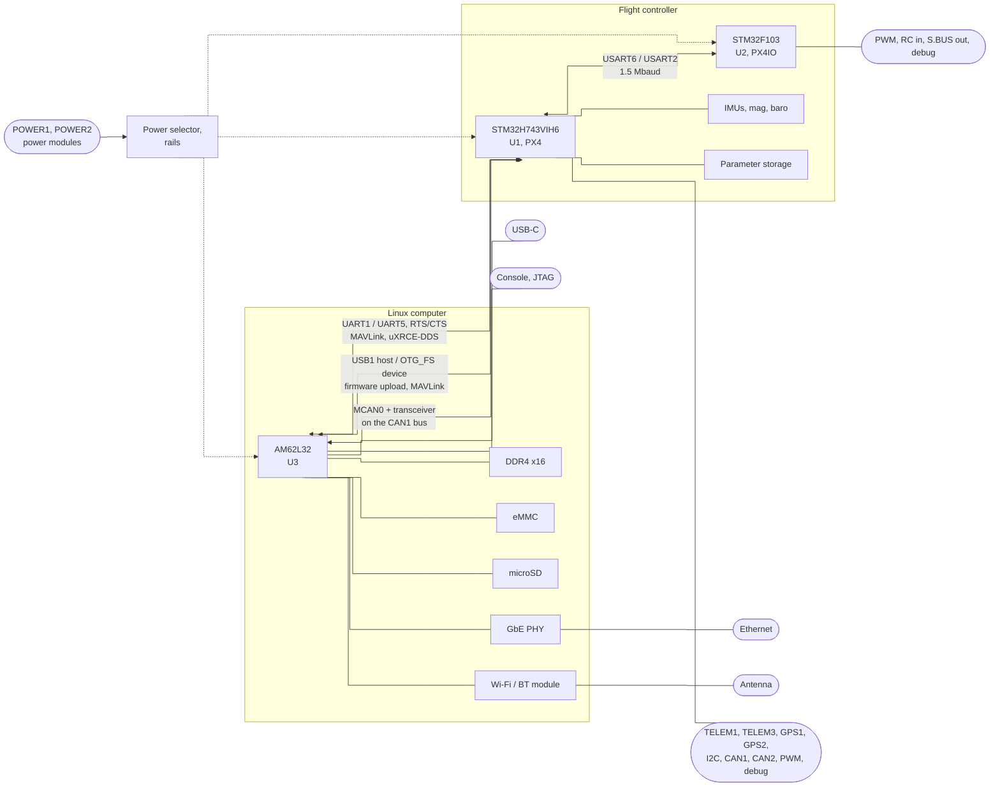
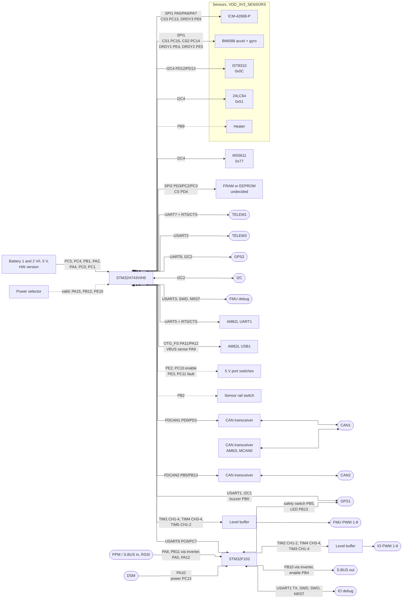
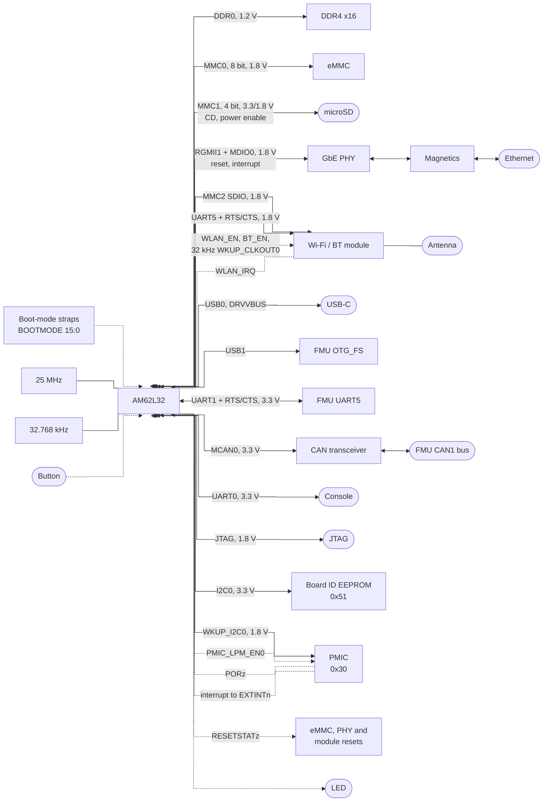
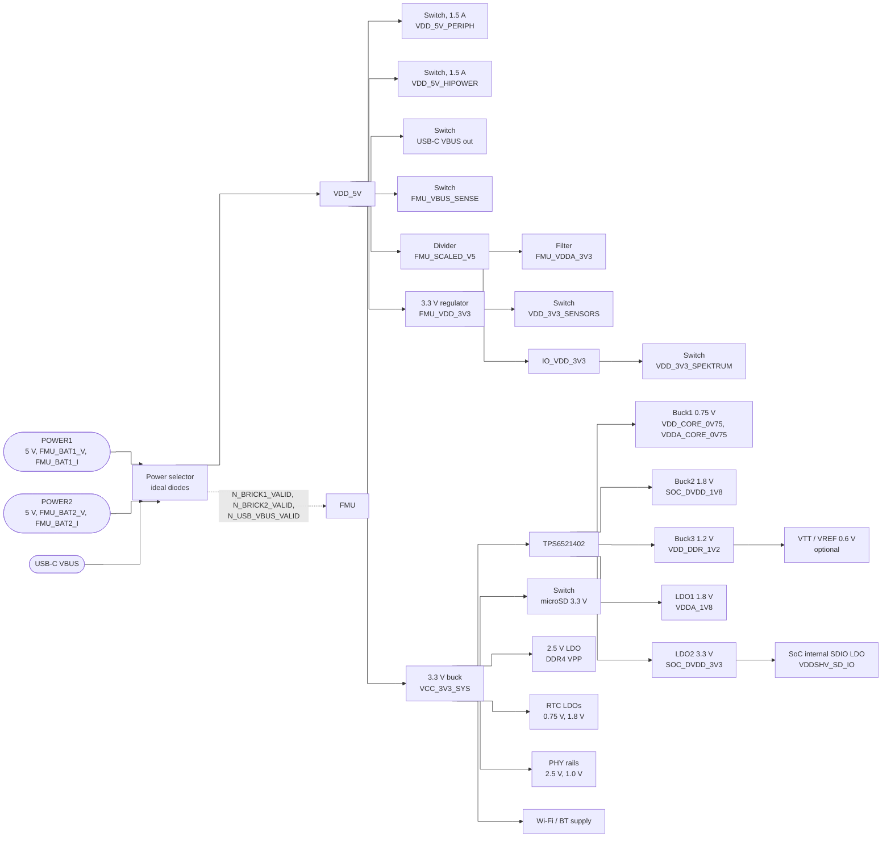

<!-- SPDX-License-Identifier: CC-BY-4.0 -->
# pinion block diagrams

How every block on the board connects. Net names and pins are those in
[`../pinout/`](../pinout/); if a diagram and a pinasg file disagree, the pinasg
file is right. Dashed lines are power or control, solid lines are data.

Parts marked *(select)* are not chosen yet; see
[`../notes/decisions.md`](../notes/decisions.md).

## 1. System

## 2. Flight controller

## 3. Linux computer

## 4. Power tree

The input side follows the FMUv6C. The Linux side is proposed; the 5 V budget
is open (see the decisions note).

## 5. Buses

| Bus | Controller pins | Devices | Level |
|---|---|---|---|
| FMU SPI1 | PA5 SCK, PA6 MISO, PA7 MOSI | BMI088 accel (CS PC15, DRDY PE4), BMI088 gyro (CS PC14, DRDY PE5), ICM-42688-P (CS PC13, DRDY PE6) | 3.3 V, sensor rail |
| FMU SPI2 | PD3 SCK, PC2 MISO, PC3 MOSI | Parameter storage (CS PD4) | 3.3 V |
| FMU I2C4 | PD12 SCL, PD13 SDA | IST8310 0x0C, MS5611 0x77, calibration EEPROM 0x51 | 3.3 V, sensor rail |
| FMU I2C1 | PB8 SCL, PB7 SDA | GPS1 connector | 3.3 V |
| FMU I2C2 | PB10 SCL, PB11 SDA | GPS2 and I2C connectors | 3.3 V |
| FMU CAN1 | PD0 RX, PD1 TX | CAN1 connector; AM62L MCAN0 (B15 RX, B16 TX) | bus |
| FMU CAN2 | PB5 RX, PB13 TX | CAN2 connector | bus |
| FMU USART6 | PC6 TX, PC7 RX | IO MCU USART2 (PA3 RX, PA2 TX) | 3.3 V |
| FMU UART5 | PC12 TX, PD2 RX, PC8 RTS, PC9 CTS | AM62L UART1 (C11 RXD, A12 TXD, A8 CTSn, B10 RTSn) | 3.3 V |
| FMU OTG_FS | PA11 DM, PA12 DP | AM62L USB1 (AC5 DM, AB5 DP) | USB |
| SoC I2C0 | B7 SCL, A7 SDA | Board ID EEPROM 0x51 | 3.3 V |
| SoC I2C1 | D7 SCL, A6 SDA | Spare | 3.3 V |
| SoC WKUP_I2C0 | AB22 SCL, AA22 SDA | PMIC 0x30 | 1.8 V |
| SoC MDIO0 | AC15 MDC, AC13 MDIO | Ethernet PHY | 1.8 V |
| SoC UART5 | D18 RXD, C23 TXD, E18 RTSn, E22 CTSn | Bluetooth HCI | 1.8 V |
| SoC MMC2 | R23 CLK, U23 CMD, U22/T22/T23/R22 DAT0-3 | Wi-Fi SDIO | 1.8 V |

## 6. Connectors

| Connector | Type | Signals |
|---|---|---|
| POWER1, POWER2 | JST-GH 6 | 5 V, 5 V, CURRENT, VOLTAGE, GND, GND |
| TELEM1 | JST-GH 6 | VDD_5V_HIPOWER, UART7 TX, RX, CTS, RTS, GND |
| TELEM3 | JST-GH 6 | VDD_5V_PERIPH, USART2 TX, RX, NC, NC, GND |
| GPS1 | JST-GH 10 | VDD_5V_PERIPH, USART1 TX, RX, I2C1 SCL, SDA, safety switch, safety LED, 3V3, buzzer, GND |
| GPS2 | JST-GH 6 | VDD_5V_HIPOWER, UART8 TX, RX, I2C2 SCL, SDA, GND |
| I2C | JST-GH 4 | VDD_5V_PERIPH, I2C2 SCL, SDA, GND |
| CAN1, CAN2 | JST-GH 4 | VDD_5V_PERIPH, CAN_H, CAN_L, GND |
| FMU PWM | JST-GH 10 | VDD_SERVO, FMU_CH1..8, GND |
| IO PWM | JST-GH 10 | VDD_SERVO, IO_CH1..8, GND |
| DSM | JST-ZH 3 | VDD_3V3_SPEKTRUM, GND, DSM in |
| PPM/SBUS RC | JST-GH 5 | 5 V, PPM/S.BUS in, RSSI in, NC, GND |
| SBUS OUT | JST-GH 3 | NC, S.BUS out, GND |
| FMU debug | JST-SH 10 | 3V3, USART3 TX, RX, SWDIO, SWCLK, NC, NC, NC, NRST, GND |
| IO debug | JST-SH 10 | 3V3, USART1 TX, NC, SWDIO, SWCLK, SWO, NC, NC, NRST, GND |
| USB-C | USB 2.0 Type-C | AM62L USB0 |
| Ethernet | *(select)* | 4 pairs from the PHY magnetics |
| microSD | push-push socket | AM62L MMC1 |
| SoC console | *(select)* | UART0 TX, RX, GND |
| SoC JTAG | *(select)* | TCK, TMS, TDI, TDO, TRSTn, EMU0, EMU1, 1.8 V reference, GND |
| Antenna | U.FL or chip antenna *(select)* | Wi-Fi / BT |
